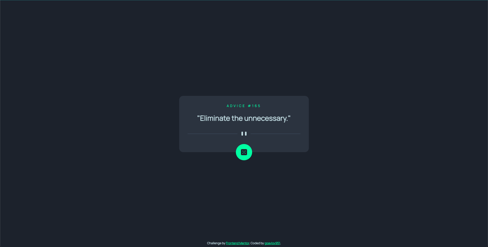
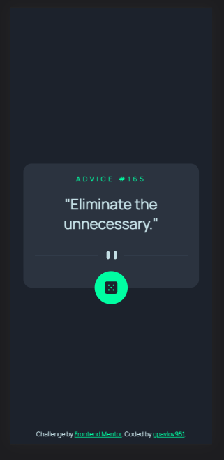

# Frontend Mentor - Advice generator app solution

This is a solution to the [Advice generator app challenge on Frontend Mentor](https://www.frontendmentor.io/challenges/advice-generator-app-QdUG-13db). Frontend Mentor challenges help you improve your coding skills by building realistic projects.

## Table of contents

- [Overview](#overview)
  - [Screenshot](#screenshot)
  - [Links](#links)
- [My process](#my-process)
  - [Built with](#built-with)
  - [Continued development](#continued-development)
- [Author](#author)

## Overview

### Screenshot

### Links

<!-- - Solution URL: [Advice generator app Solution](https://www.frontendmentor.io/solutions/qr-code-component--5zWTaihgq) -->
- Live Site URL: [Advice generator app](https://gpavlov951.github.io/frontend-mentor-playground/advice-generator-app/)

## My process

### Built with

- Semantic HTML5
- Flexbox
- Mobile-first workflow

### Continued development

I want to focus on improving my HTML and CSS knowledge. My goal is to develop designs with fewer HTML elements and CSS variables and classes.

## Author

- Frontend Mentor - [@gpavlov951](https://www.frontendmentor.io/profile/gpavlov951)
- Github - [@gpavlov951](https://github.com/gpavlov951)
